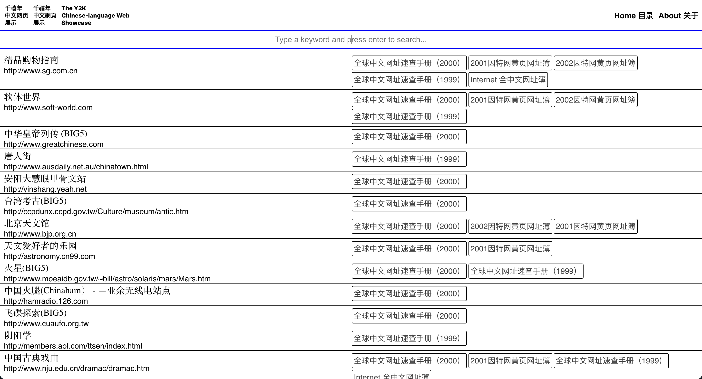
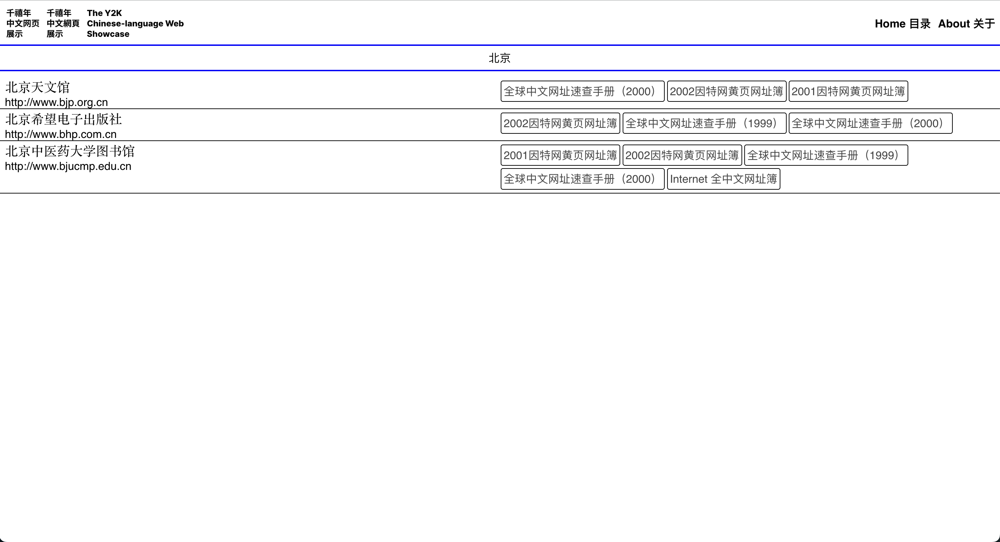
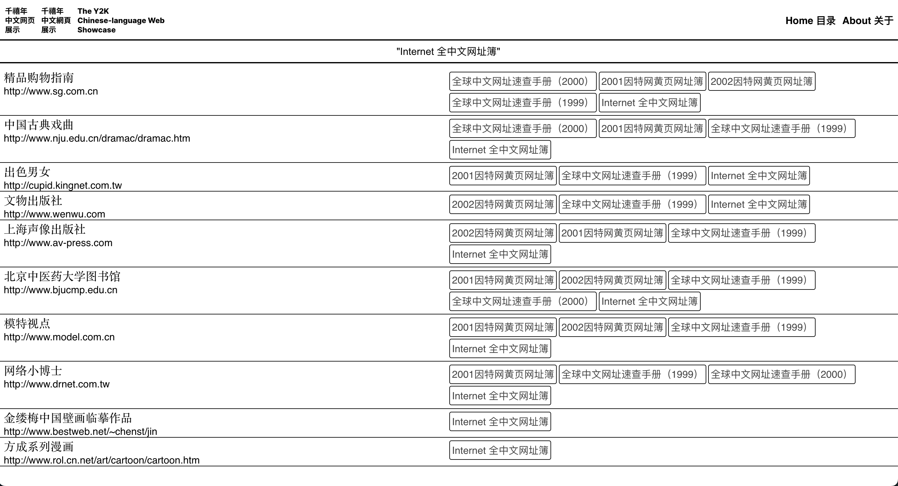
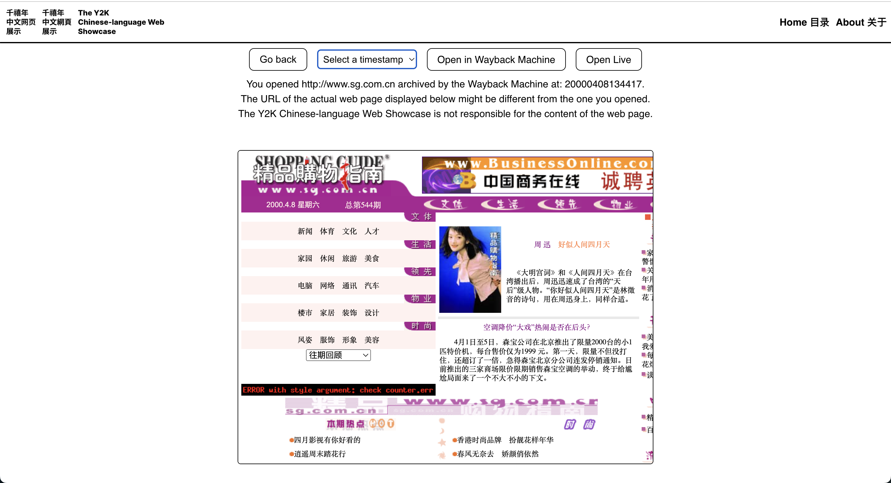

### The Yellow Page

This website showcases Chinese-language web pages at the turn of the millennium. The web pages are collected from "Internet directory" books published in the late 1990s and early 2000s in mainland China, covering web pages produced by people based in Chinese-speaking regions and diaspora communities across the globe.

These directory books - often marketed as “yellow pages” of the Internet - provide lists of URLs of Chinese-language web pages organised into hierarchical categories for Chinese-speaking Internet users. These directory books provide insight into how the Internet was experienced and used by Chinese-speaking users at the turn of the millenium.

On this website, you can visit some of the URLs featured in these books via the Internet Archive's Wayback Machine.

You can use the search box on the main page to search for web pages containing certain keywords in their titles or category information (to be implemented), or use the book filter on the right column to view web pages included in one particular directory book.

The content on these web pages does not reflect the views or opinions of the owners of this website. Visitors are advised to use their own discretion when browsing these websites and should not rely on the information presented as accurate or current. The owners of this website are not responsible for any harm, damage, or loss that may occur from using the content or information provided on these old websites. Please note that the web pages showcased on the website are archived the copies stored on the Wayback Machine, and this website does not host any archived web page material.

The project is partly sponsored by the Puget Sound Public Interest Technology Clinic of the University of Washington. This website is not affiliated with the Internet Archive.

### Live Demo

The main page of the webpage demonstrates all of the representative Chinese Archived Websites. The list consists of around 200 weblinks dynamcally received from the Airtable database. 
   

The website enables full-text search functionality on both the website name and related publishment. The search syntax and content is encapsulated and passed through Airtable database api. The full-text search on related publishment is trigger by clicking on the individual tags. 
  

  

Once the user click on a link, the webpage will present a detailed description of the archived web page. The User can interact with the archived webpage through iframe and select availble archival timeslot to see the webpage in different stages. 
  

